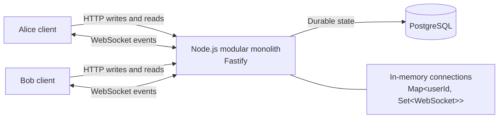
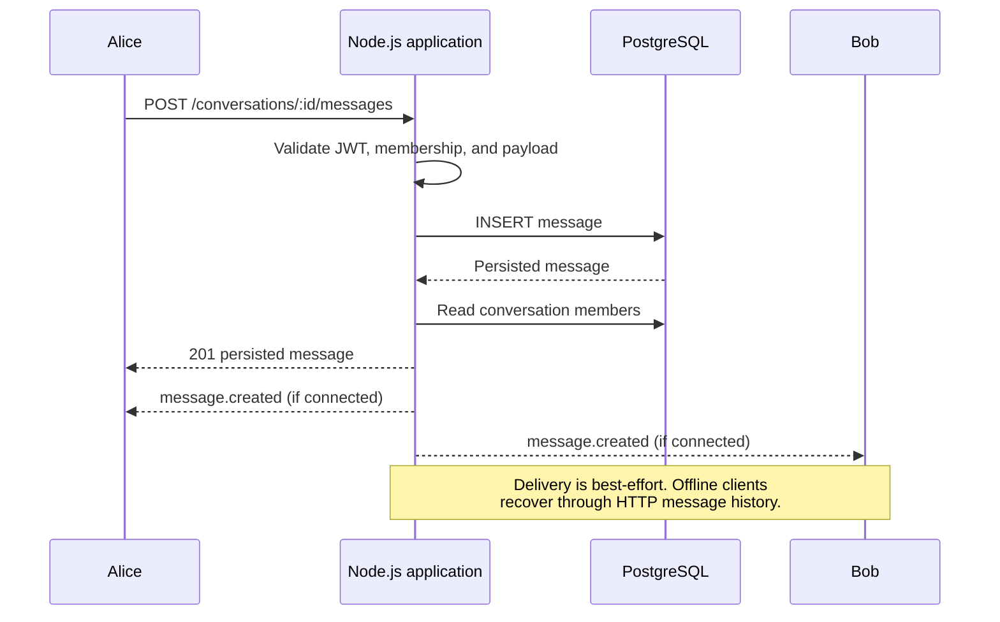

# Initial Architecture

## Goal

Build the smallest reliable real-time messenger for learning the Node.js ecosystem and system design fundamentals.

The initial roadmap supports authenticated one-to-one text messaging. Messages are persisted through HTTP and delivered in real time when a member is connected.

## System Context



The application is a single deployable modular monolith built with Fastify and `@fastify/websocket`. It owns the HTTP API, WebSocket connections, authentication, message persistence, and real-time delivery.

There is one application instance in the initial architecture.

## Components

### Node.js Application

- Exposes HTTP endpoints for authentication, conversations, sending messages, and message history.
- Exposes a WebSocket endpoint for real-time events.
- Authenticates WebSocket connections using a JWT in the WebSocket subprotocol.
- Validates all HTTP input.
- Persists messages before reporting successful acceptance through HTTP.
- Keeps a `Map<userId, Set<WebSocket>>` of connected client devices.
- Delivers a persisted message immediately to each connected member socket.

### PostgreSQL

PostgreSQL is the source of truth for users, conversations, members, and messages. A client reconnecting after an offline period recovers messages through the HTTP history endpoint.

### Clients

Clients use HTTP for request-response operations and WebSocket for server-initiated real-time events. They must tolerate duplicate events and reconnect safely.

## Message Flow



Persisting before delivery is mandatory. WebSocket delivery is best-effort; PostgreSQL provides recovery after a failed connection or application restart.

## Data Model

```text
users
  id, email, password_hash, created_at

conversations
  id, created_at

conversation_members
  conversation_id, user_id

messages
  id, conversation_id, sender_id, content, created_at
```

Current constraints and indexes:

- A canonical unique user pair prevents duplicate direct conversations.
- The composite primary key on `(conversation_id, user_id)` prevents duplicate memberships.
- An index on `(conversation_id, created_at ASC, id)` supports chronological message history.
- Conversation membership is checked before reading or sending messages.

## WebSocket Contract

WebSocket connections authenticate through `Sec-WebSocket-Protocol` with
`bearer, <JWT>`. The current events are:

```text
Server -> Client: connection.accepted
Server -> Client: message.created
```

Messages are sent through the HTTP API. WebSocket delivery is an optional real-time notification, not the durable write path.

## Explicit Non-Goals

The initial architecture does not include:

- Multiple application instances or a dedicated WebSocket gateway.
- Redis, queues, background workers, or webhooks.
- Groups, delivery/read receipts, typing indicators, or presence.
- Attachments, push notifications, search, or end-to-end encryption.
- Event brokers or microservices.

## Evolution Triggers

Introduce a component only when its problem exists:

| Trigger                                                                | Next addition                                                                   |
| ---------------------------------------------------------------------- | ------------------------------------------------------------------------------- |
| Multiple application instances                                         | Redis for cross-instance socket event distribution and connection coordination. |
| Slow or retryable work such as push notifications and media processing | A queue and background worker.                                                  |
| External server-to-server integrations                                 | Transactional outbox and signed webhooks.                                       |
| Large binary attachments                                               | S3-compatible object storage.                                                   |
| Proven search requirements                                             | A dedicated search index.                                                       |

## Architectural Review Checklist

Before accepting an increment, verify:

- Does it solve a current requirement with the smallest practical design?
- Does the modular monolith remain the right boundary?
- Is durable state stored in PostgreSQL rather than process memory?
- Is untrusted input validated at the HTTP or WebSocket boundary?
- Does the change have a focused, meaningful test?
