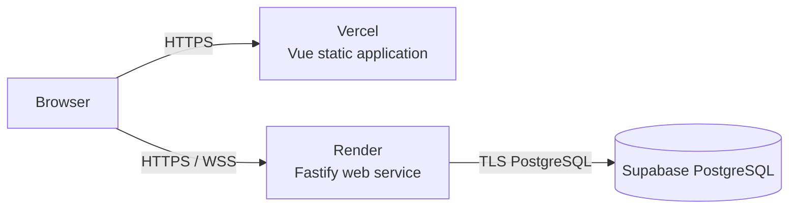

# Production Deployment

## Architecture

Deploy the Vue application as a Vercel project with `apps/web` as its root
directory. Deploy the Fastify application as one Render web service using the
root `render.yaml`. Use Supabase only as managed PostgreSQL.

The browser communicates only with the Fastify API. Do not expose a Supabase
project URL, database URL, or Supabase key to the frontend.



## Provision PostgreSQL

1. Create a Supabase project in a region close to the intended Render region.
2. In the Supabase Connect dialog, copy the connection string for the selected
   connection mode. A persistent Render service can use a direct connection;
   use the session pooler if the service network requires IPv4.
3. Keep the connection string in Render only as `DATABASE_URL`.

## Deploy the Backend

1. In Render, create a Blueprint from this repository's `render.yaml`.
2. Before the first deploy, choose a Render region close to the Supabase
   project. A service region cannot be changed after creation.
3. Set `DATABASE_URL` to the Supabase connection string.
4. Leave the generated `JWT_SECRET` unchanged. It is intentionally not shared
   with Vercel.
5. Deploy the service and record its HTTPS URL, for example
   `https://newmessenger-api.onrender.com`.

`render.yaml` deliberately does not run migrations. Apply migrations as an
explicit release step after setting `DATABASE_URL` locally:

```bash
DATABASE_URL='<Supabase connection string>' corepack pnpm migration:up
```

Run this command once per release, before deploying application code that
depends on the new schema. Do not put it in the application start command.

## Deploy the Frontend

1. In Vercel, import this GitHub repository as a new project.
2. Set the project's Root Directory to `apps/web`.
3. Set `VITE_API_BASE_URL` to the Render HTTPS API URL for the Production
   environment. This is a public build-time value, so it must not contain a
   secret.
4. Deploy the project and record its production URL.
5. Set the Render `CORS_ORIGIN` to that exact Vercel origin, such as
   `https://newmessenger.vercel.app`, then redeploy the backend.

The browser derives `wss://` from the HTTPS value of `VITE_API_BASE_URL`.

## Smoke QA

After both deployments are live:

1. Confirm `GET <Render URL>/health` returns `200`.
2. In two separate browser sessions, register two users and create a direct
   conversation.
3. Send a message from one session and confirm it appears in the other without
   refresh.
4. Confirm browser DevTools show HTTPS API requests and a `wss://` connection.
5. Disconnect one session temporarily, send a message from the other, restore
   the network, and confirm history recovery.

## Rollback

- For an application regression, roll back the Vercel and Render deployments
  to their previous release independently.
- Do not roll back a database migration automatically. First deploy compatible
  application code, then inspect the migration before running
  `corepack pnpm migration:down` against the production connection string.
- If the backend URL changes during rollback, update `VITE_API_BASE_URL`, redeploy
  Vercel, and align Render `CORS_ORIGIN` with the resulting frontend origin.
