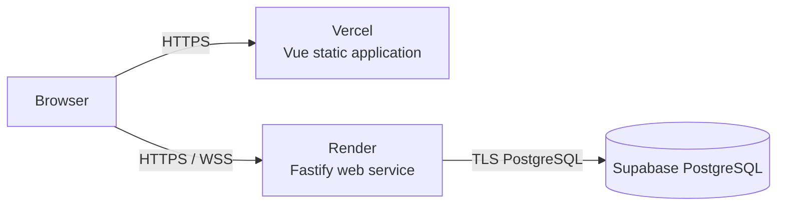

# Production Deployment

## Architecture

Deploy the Vue application as a Vercel project with `apps/web` as its root
directory. Deploy the Fastify application as one Render web service using the
root `render.yaml`. Use Supabase only as managed PostgreSQL.

The initial Render service uses the Free compute plan for MVP demonstration.
Render can spin down an idle Free service, disconnecting WebSocket clients and
causing a cold start on the next connection. The client reconnects and recovers
history, but this plan is not suitable for continuous production availability.

The browser communicates only with the Fastify API. Do not expose a Supabase
project URL, database URL, or Supabase key to the frontend.

Application rate limits and trusted client-IP extraction are not implemented.
Before enabling them, resolve the provider/ingress questions and owner approval
gates in the [API abuse-protection decision](../architecture/api-abuse-protection.md).
Do not use Render's outbound IP ranges as an inbound proxy allowlist or enable
unconditional proxy trust. This documentation does not change Render settings.



## Current Public MVP

The deployed MVP uses the following public endpoints:

- Frontend: `https://newmessenger-sigma.vercel.app`
- Backend: `https://newmessenger-api.onrender.com`
- Health check: `https://newmessenger-api.onrender.com/health`

These URLs are public configuration, not credentials. Do not add database
connection strings, Supabase keys, or JWT secrets to this document.

## Provision PostgreSQL

1. Create a Supabase project in `us-east-1`, close to the Render Virginia
   region.
2. Keep the Data API and automatic table exposure disabled. The Fastify
   backend, not Supabase, is the application's public API.
3. In the Supabase Connect dialog, select **Session pooler** and copy its URI.
   This provides an IPv4-compatible connection for the Render service.
4. Keep the connection string in Render only as `DATABASE_URL`.

## Deployment Order

Use this order for the first deployment:

1. Provision Supabase and obtain the Session Pooler URI without sharing it.
2. Apply migrations explicitly against Supabase.
3. Create the Vercel project with `apps/web` as its root directory to reserve
   its production URL. The first build can report the API as unavailable.
4. Create the Render Blueprint with the Vercel URL as `CORS_ORIGIN` and the
   Session Pooler URI as `DATABASE_URL`.
5. Configure the Render URL as Vercel's production `VITE_API_BASE_URL` and
   redeploy Vercel.
6. Run the public smoke QA before announcing the deployment.

## Deploy the Backend

1. In Render, create a Blueprint from this repository's `render.yaml`.
2. The Blueprint deploys the service in Render's Virginia region, matching the
   Supabase `us-east-1` project. A service region cannot be changed after
   creation.
3. Set `DATABASE_URL` to the Supabase connection string.
4. Leave the generated `JWT_SECRET` unchanged. It is intentionally not shared
   with Vercel.
5. Deploy the service and record its HTTPS URL, for example
   `https://newmessenger-api.onrender.com`.

The Blueprint installs the pinned pnpm version through npm before building.
This avoids relying on the Corepack bundled with the Render Node runtime, which
can fail package-signature verification for newer pnpm releases.

`render.yaml` deliberately does not run migrations. Apply migrations as an
explicit release step from a trusted terminal:

```bash
printf "Supabase DATABASE_URL: "
read -r -s DATABASE_URL
echo
export DATABASE_URL
corepack pnpm migration:up
unset DATABASE_URL
```

Run this command once per release, before deploying application code that
depends on the new schema. The first command reads the connection string
without echoing it or adding it to shell history. Do not put migrations in the
application start command.

## Deploy the Frontend

1. In Vercel, import this GitHub repository as a new project.
2. Set the project's Root Directory to `apps/web` and use the Vite preset.
3. Deploy once to obtain the Vercel production URL.
4. Set `VITE_API_BASE_URL` to the Render HTTPS API URL for the Production
   environment. This is a public build-time value, so it must not contain a
   secret.
5. Set the Render `CORS_ORIGIN` to that exact Vercel origin, such as
   `https://newmessenger-sigma.vercel.app`.
6. Redeploy Vercel after saving `VITE_API_BASE_URL`.

The browser derives `wss://` from the HTTPS value of `VITE_API_BASE_URL`.

## Smoke QA

After both deployments are live:

1. Confirm `GET <Render URL>/health` returns `200`.
2. In two separate browser sessions, register two users and create a direct
   conversation.
3. Send a message from one session and confirm it appears in the other without
   refresh.
4. Confirm browser DevTools show HTTPS API requests and a `wss://` connection.
5. Close one client session, send a message from the other, then reopen the
   client and confirm history recovery.

## Rollback

- For an application regression, roll back the Vercel and Render deployments
  to their previous release independently.
- Do not roll back a database migration automatically. First deploy compatible
  application code, then inspect the migration before running
  `corepack pnpm migration:down` against the production connection string.
- If the backend URL changes during rollback, update `VITE_API_BASE_URL`, redeploy
  Vercel, and align Render `CORS_ORIGIN` with the resulting frontend origin.
